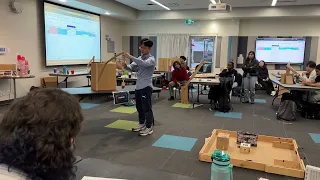

# BCIT Engineering Competition 2024 - Junior Design Project

This repository showcases my participation in the **BCIT Engineering Competition 2024 (Junior Design)**. The challenge was to design and build a mechanism capable of rescuing a person ("Fed") from a high-rise building within a strict time limit of 2 hours and 45 minutes. My design took inspiration from industrial cranes and incorporated a 2D delta robot configuration for a fast, secure, and efficient rescue mechanism.

---

## Table of Contents
1. [Project Overview](#project-overview)
2. [Design Details](#design-details)
3. [Materials and Budget](#materials-and-budget)
4. [Machine Highlights](#machine-highlights)
5. [Evaluation Criteria](#evaluation-criteria)
6. [Presentation Video](#presentation-video)
7. [Future Improvements](#future-improvements)
8. [Acknowledgments](#acknowledgments)

---

## Project Overview

The main objective of this competition was to address the challenge of high-rise rescues. Our device needed to:
- Extend out from a base to "reach" the person.
- Securely pick up "Fed" and place them on a target.
- Minimize cost while maximizing operational efficiency and simplicity.

We had a time limit of **2 hours and 45 minutes** to brainstorm, build, and test the device. Teams were provided virtual currency ("BEC Bucks") to "purchase" materials from a shop. My approach leveraged a delta robot configuration for its speed and precision, combined with industrial crane-like stability for extended reach.

---

## Design Details

### Base
- Constructed from a **cardboard box** to save time and materials.
- Provided a stable foundation for the mechanism.

### Links
- Made using **long wooden dowels**, reinforced with **cardboard** and **hot glue** for strength and stiffness.

### Joints
- **Paper clips** were creatively repurposed as flexible joints, ensuring smooth movement and articulation.

### Gripper Mechanism
- The standout feature of the design was a **2D delta robot-inspired gripper**.
- Utilized **drinking straws** for their flexibility and lightweight properties, ensuring the gripper could reach and securely handle the target.

### Elastic Elements
- **Thin rubber bands** and **thick rubber bands** provided tension and flexibility for actuation.

---

## Materials and Budget

Teams were allocated **250 BEC Bucks** to buy materials. The following components were utilized in my design:

| **Material**              | **Quantity** | **Cost (BEC Bucks)** |
|---------------------------|--------------|-----------------------|
| Wooden Dowels             | 20 pieces    | 60                   |
| Drinking Straws           | 10 pieces    | 10                   |
| Zip Ties                  | 6 pieces     | 10                   |
| Thin Rubber Bands         | 10 pieces    | 10                   |

### Free Materials
- **Cardboard**: 3 sheets
- **Thick Rubber Bands**: 3 pieces
- **Paper Clips**: 5 pieces
- **Glue Sticks**: 10 sticks

**Total Cost**: 90 BEC Bucks

---

## Machine Highlights

### 1. Delta Robot Gripper
- The gripper mechanism, inspired by a delta robot, featured:
  - **Straws** as flexible arms for precise and lightweight motion.
  - A simple but effective design for securely picking up the target.

### 2. Efficient Link Construction
- Long wooden dowels reinforced with cardboard and glue were used as links.
- This approach ensured stiffness while staying within the competition's budget and time constraints.

### 3. Creative Use of Joints
- **Paper clips** were innovatively used as joints, allowing for smooth articulation without the need for complex hinges or additional materials.

### 4. Stable Base
- The entire cardboard box served as the base, providing stability and saving time for other parts of the mechanism.

---

## Evaluation Criteria

The project was judged on the following criteria:
1. **Functionality** (40 points)
   - Successful rescue and placement of "Fed."
   - Building height reached.
   - Efficient use of materials.
2. **Creativity and Aesthetics** (40 points)
   - Innovation and uniqueness of the design.
   - Cleanliness and overall presentation.
3. **Presentation** (20 points)
   - Explanation of the problem, design process, and decisions.
   - Justification of materials and critique for improvements.

Penalties were applied for dropped rescues, collisions, or exceeding time limits.

---

## Presentation Video

---

## Future Improvements

While the design performed well in the competition, I have identified areas for improvement:
1. **Precision Control**:
   - Incorporate tension adjustments to improve control of the gripper mechanism.
2. **Improved Actuation**:
   - Add elastic or spring-loaded actuators for smoother and more consistent movements.
3. **Scalability**:
   - Experiment with modular designs for adapting to different rescue scenarios.

---

## Acknowledgments

Special thanks to the BCIT Engineering Competition organizers, my teammates (Ken, Harry), and the mentors (James) who supported this event. Their efforts made this an incredible learning opportunity.

---
